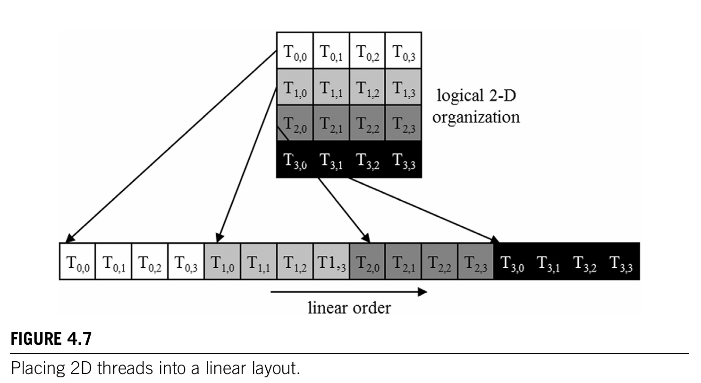
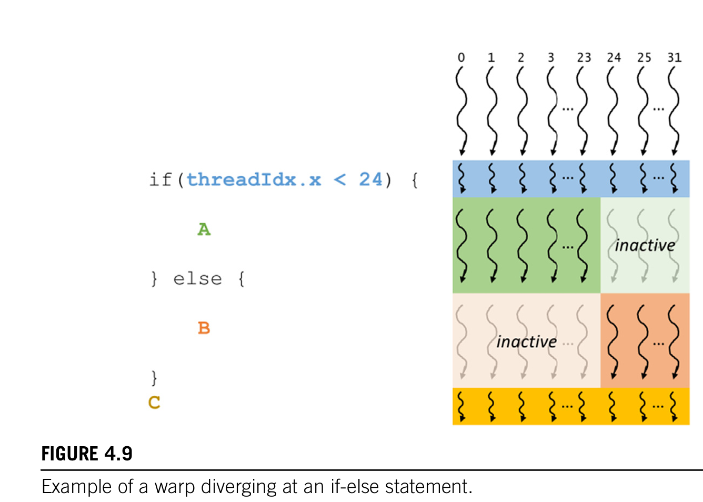

# Chapter 4 计算架构和调度

## 4.1 现代gpu架构

A100 的 sm数量是 108个SM流处理器， 

- 每个sm单元有 64个核 总共6912个  
- 每个SM单元有 4个 Tesnor core 核心， 完整gpu共432个Tensor 核心

H100 的 sm数量是 114个SM流处理器

- 每个sm单元有 128个核 总共14592个  
- 每个SM单元配备4个第四代Tensor核心，每个完整GPU配备456个Tensor核心 

Blackwell (GB200 NVL72)

- SM: 8640 (120 × 72)
- Tensor Core: 34,560
- HBM: ~13.8 TB
- 单一 NVLink 计算域

## 4.2 块调度

- 一个块中的所有线程都会同时分配给一个sm
- sm数量有限， 同时分配给每个sm的块数量有限
- 排队机制会确保 新的block执行完时分配新的block给SM
- 线程因为在一个sm里 能确保线程能够
  - 1. 访问共享内存  
  - 2. 屏蔽同步  

# 4.3 同步和透明可拓展性

- 一个块中的线程通过 `_ _ syncthreads( )` (两个_ 符号)  
等同一个block 中每个线程都到达了该位置再进入下一个阶段

- Barrier synchronization ----- for coordinating parallel activities
  - eg. four people shopping and wait for all to leave  


- __ syncthreads ( )使用规范
  - it must be executed by all threads in a block 
    - cannot be put in a if-else statement , if only one __ syncthreads ( ) is placed since it violate the rule
    必须被所有一个block的所有线程执行 不能在if 或者else的单个中执行 否则会死锁

- cuda runtime system可以以任何相对顺序执行块
 因为块之间没有同步约束

## 4.4 线程束 warp 和SIMD 硬件

### 4.4.1 warp的基本分配策略

- 一旦一个块被分配给SM，就会被进一步划分为32个线程单元 称之为线程束warp
- 目前线程束都是32个线程

- 如果一个block是被组织成一维的数组，那么warp从 threadidx.x = 0 开始
到31结束
  - 如果是32的倍数，那么被分成个
  - 如果不是 余数会被划分为另一个warp

- 如果是多维数组，会先线性投影到线性布局， x从小到大，然后再是y

### 4.4.2 SIMD和 warp

- 在任意时刻，为warp的所有thread给提取并执行一条指令
- a100 的 sm 里64个核心， 被分成了4个processing block,每个处理块 有16个核心
- 同一个warp 的thread被分配到一个processing block.
- 同一个processing block为warp中所有thread 
  获取 并且执行 这些指令instruction
- 由于这些线程对数据的不同部分执行了相同的指令，被称之为SIMD

## 4.5 控制发散

少写if else 
否则要分路径执行
 

如果同一个warp内 所有线程必须都完成某个阶段
那么必须要依靠 __ syncwarp() __ 来保证正确性

## 4.6 Warp scheduling and latency tolerance


### 4.6.1 什么是latency tolerance / hiding

1. warp A 触发一个 global memory load（很慢）
2. warp A 被标记为“等待”
3. SM 的 warp scheduler 选择 warp B 来执行
4. 当 warp B 也遇到延迟 → 选 warp C，依此类推

是warp执行到需要等待启动的长延迟操作， 这种操作称之为latency tolerance
为了让sm计算单元永远有可以计算的warp不会 出现sm 空等内存的情况

### 4.6.2 warp scheduling 还用于其他类型的操作延迟

- pipelined floating-point arithmetic 流水线浮点运算
- branch instructions 分支指令

选择准备执行的warp 不会在执行时间线中引入任何空闲 或 浪费时间

### 4.6.3 硬件上面的设计 不同架构

为了让latency tolerance 实现，最好为sm单元分配 比起执行资源更多的线程

一个SM 通常被分配非常多线程

- 一个 SM 可能只有 64 或 128 个 FP32 cores  
- 但 SM 上常驻的线程可能是 2048 个  


旧架构：
- 一个 SM = 一个 warp 同时执行 → 比如 32 线程 lockstep 执行同一条指令

新架构：
- 一个 SM 可以并行调度多个 warp
- 例如 Ampere 可以 dual-issue，甚至同时来自不同 warp 的指令

`超额订阅` oversubscription 

## **GPU 高吞吐量 = zero-overhead scheduling + oversubscription**


> **GPU 通过让每个 warp 的完整执行状态常驻于 SM 寄存器，从而实现零开销 warp 切换，并依靠大量活跃 warps 的 oversubscription 来隐藏所有长延迟（memory、branch、pipeline）操作，从而维持高吞吐量。**

## 4.7 Resource partitioning and occupancy p85

### 4.7.1 occupancy占用率

- the ratio of the number warps assigned to an SM
- to the maximum number it supports 
- Occupancy =（实际可在 SM 上运行的 warps 数）/（SM 允许的最大 warps 数）

### 4.7.2 执行资源和跨线程动态分配

sm的执行资源包括：  

- 寄存器 register
- 共享内存 shared memory
- 线程槽 thread slot
- 线程块槽 thread block slot

A100 / H100 / B200 / 3090 / 5090 全部一致

| 资源                  | 数值       | 说明                |
| ------------------- | -------- | ----------------- |
| **最大 blocks / SM**  | **32**   | 理论上限              |
| **最大 threads / SM** | **2048** | = 64 warps        |
| **最大 warps / SM**   | **64**   | warp = 32 threads |
| **warp size**       | **32**   | 永久不变              |


各个资源之间会有制约关系

#### `4.7.2.1 如果block太小 block槽不够用`

##### 例子：block = 32 threads

理论上（2048/32 = 64 blocks），但是：

- 一个 SM 只能同时支持 **最多 32 blocks**

- 所以只能开出 **32 blocks × 32 threads = 1024 threads**

→ 线程槽只用了 1024/2048 = **50% occupancy**

💡 结论：  
**block 太小，会被 block 数限制住，从而无法填满线程槽**


#### `4.7.2.2 block 大小不是 2048 的因数时也会损失 occupancy`

例如 block = **768 threads**

- 2048 / 768 = 2.66 → 只能放 **2 blocks**

- 2 blocks = **1536 threads**

- 剩余 512 thread slots 必然浪费掉

→ occupancy = 1536 / 2048 = **75%**


#### `4.7.2.3 寄存器也会限制 occupancy`

A100 有：

- **65536 registers / SM**
    

要达到满 occupancy：

- 2048 threads 平均能用的寄存器数为  
    65536 / 2048 = **32 registers per thread**
    

##### Example 1：使用 31 registers（OK）

- 2048 threads × 31 = 63488（<65536）
    
- occupancy = **100%**
    

##### Example 2：使用 33 registers（不够用！）

- 2048 × 33 = 67584（>65536）
    
- 无法同时运行 2048 threads → 系统减少 blocks 数
    

可能变成：

- 3 blocks × 512 threads = 1536 threads  
    寄存器需求：1536×33 = 50688（可以）
    

→ occupancy = 1536/2048 = **75%**

🎯 **仅仅多定义两个自动变量（多用 2 个寄存器），occupancy 从 100% 掉到 75% → 这就是性能悬崖（performance cliff）。**


### 4.8 查询设备属性

# 🚀 用于查询属性的 CUDA 运行时函数

## 1. **cudaGetDeviceCount(int* count)**

返回有多少台支持 CUDA 的设备可用。

例子：

```c++
int devCount; cudaGetDeviceCount(&devCount);
```
## 2. **cudaGetDeviceProperties(cudaDeviceProp* prop, int deviceId)**

`cudaDeviceProp`用设备的详细信息填充结构体。

例子：

```c++
cudaDeviceProp devProp; for (int i = 0; i < devCount; i++) {     cudaGetDeviceProperties(&devProp, i);     // Use devProp fields here }
```

## **3. cudaDeviceProp 结构体中常用的关键字段**

### **(1) maxThreadsPerBlock**

- 每个 Block 最多可容纳的线程数。
    
- 常见设备为 1024，但不同架构可能更低或更高。
    
- 程序应通过此字段自动选择合适的 block 大小，而不是写死为 1024。
    

---

### **(2) multiProcessorCount**

- SM 的数量。
    
- SM 越多，峰值吞吐能力越高，适合需要大量并行计算的应用。
    

---

### **(3) clockRate**

- GPU 的时钟频率。
    
- 与 SM 数量结合可估算最大硬件执行能力。
    

---

### **(4) maxThreadsDim[]**

每个 Block 维度的最大线程数：

- `maxThreadsDim[0]`: x 方向最大线程数
    
- `maxThreadsDim[1]`: y 方向最大线程数
    
- `maxThreadsDim[2]`: z 方向最大线程数
    

用于自动调优（Auto-tuning）寻找最佳 block 尺寸。

---

### **(5) maxGridSize[]**

Grid 在每个维度上的最大 block 数：

- `maxGridSize[0]`: x 方向最大 block 数
    
- `maxGridSize[1]`: y 方向最大 block 数
    
- `maxGridSize[2]`: z 方向最大 block 数
    

可用于判断数据规模是否能一次性覆盖，否则需要迭代处理。

---

### **(6) regsPerBlock**

- 每个 SM 可用的寄存器数量。
    
- 与内核（kernel）的寄存器使用量共同决定 **occupancy（占用率）**。
    
- 注意：在某些计算能力中，block 可用寄存器 ≠ SM 总寄存器。
    

---

### **(7) warpSize**

- Warp 的大小（通常为 32）。
    
- 不同架构可能变化，因此不应写死。
    

---

## **4. 其他字段**

`cudaDeviceProp` 中还有许多其他字段，用于反映设备的各类硬件特性，它们会在学习 CUDA 各章节时逐步涉及。