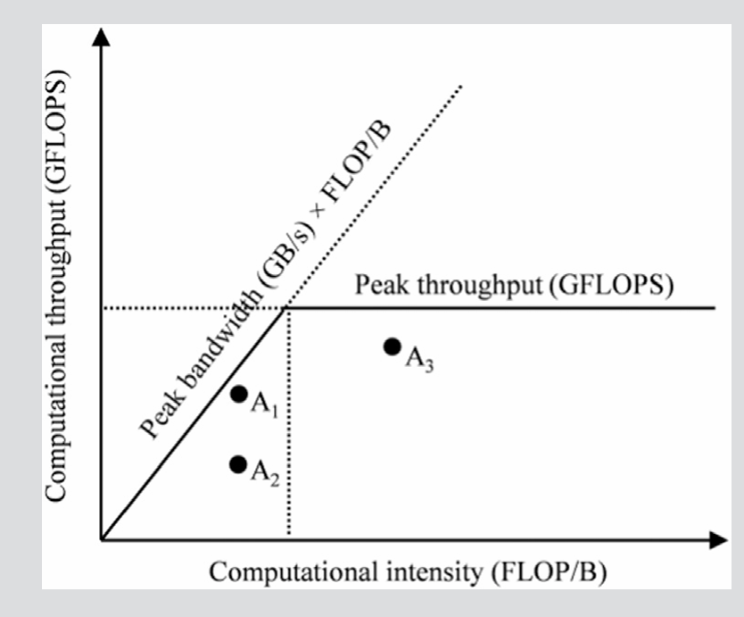

# 5 内存架构和数据局部型 memory architecture and scheduling

## 5.1.1 内存访问效率的重要性

```c++
for(int k = 0; k < Width ; ++k)
{
    Pvalue += M[row *Width +k] * M[ k* Width + col];
}
```

- 这里的一次迭代里访问了两次global memory
- 一次浮点乘法
- 一次浮点加法

计算量 2 Flops
内存访问量8Bytes(两个float 2* 4B)

计算强度 = 计算量/内存访问量 = 2/ 8 = 0.25Flops

接下来书用 A100 GPU 举例。A100 有：

- **峰值 global memory 带宽：1555 GB/s**  
- **单精度（FP32）峰值算力：19,500 GFLOPS**  
- **Tensor Cores 的 FP32 峰值：156,000 GFLOPS**  

 1555 GB/s × 0.25 FLOP/B = **389 GFLOPS**
这就是这段代码在 A100 上的 **理论上限**（只从内存带宽角度看）。

然后对比一下：

- 实际能达到：**389 GFLOPS**
- GPU 核心能达到：**19,500 GFLOPS**
389 / 19,500 ≈ **2%** 而已。

如果看 Tensor Core：

- Tensor Core 峰值：156,000 GFLOPS
- 389 / 156,000 ≈ **0.25%**


所以为了实现更高的内核性能- 需要减少内核执行的全局内存访问次数  
19500 GFLOPs / 1555GB/s = 12.5 FLOp/B  
也就是每访问4字节的浮点值 就需要进行50次浮点计算

### 5.1.2 roofline model  


### 图怎么画（概念）

- **横轴 x：算术强度（FLOP/B）**
  - 越往右代表：每从内存读 1 字节，就能做更多计算
  - 说明数据被“多次复用”

- **纵轴 y：计算吞吐（GFLOPS）**
  - 某个程序实际达到的计算能力


图上有 **两条硬件上限线**：

1. **水平线：峰值计算吞吐（compute roof）**
    - y = GPU 的最大 GFLOPS
    - 你不可能算得比这还快

2. **从原点出发的斜线：内存带宽限制线（memory roof）**
    - 斜率 = 峰值内存带宽（GB/s）
    - y = 带宽 × (FLOP/B)
    - 表示：如果你每个字节能做这么多 FLOPs，乘上带宽就是你最多能做到的 GFLOPS  


    