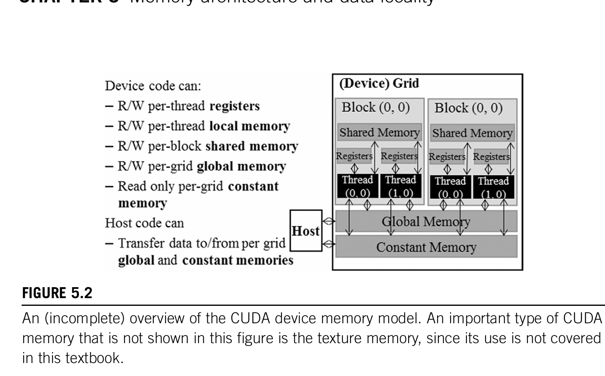
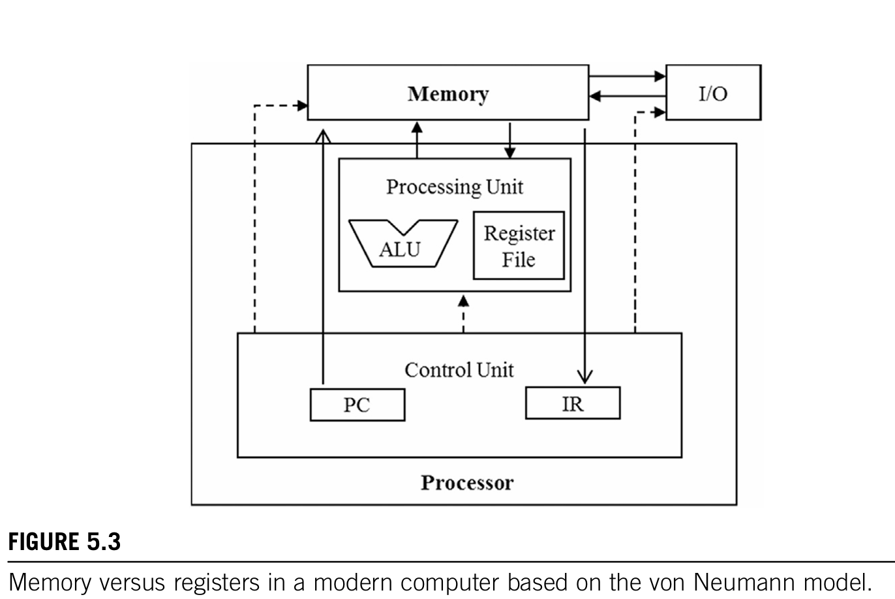

# 5 内存架构和数据局部型 memory architecture and scheduling

## 5.1.1 内存访问效率的重要性

```c++
for(int k = 0; k < Width ; ++k)
{
    Pvalue += M[row *Width +k] * M[ k* Width + col];
}
```

- 这里的一次迭代里访问了两次global memory
- 一次浮点乘法
- 一次浮点加法

计算量 2 Flops
内存访问量8Bytes(两个float 2* 4B)

计算强度 = 计算量/内存访问量 = 2/ 8 = 0.25Flops

接下来书用 A100 GPU 举例。A100 有：

- **峰值 global memory 带宽：1555 GB/s**  
- **单精度（FP32）峰值算力：19,500 GFLOPS**  
- **Tensor Cores 的 FP32 峰值：156,000 GFLOPS**  

 1555 GB/s × 0.25 FLOP/B = **389 GFLOPS**
这就是这段代码在 A100 上的 **理论上限**（只从内存带宽角度看）。

然后对比一下：

- 实际能达到：**389 GFLOPS**
- GPU 核心能达到：**19,500 GFLOPS**
389 / 19,500 ≈ **2%** 而已。

如果看 Tensor Core：

- Tensor Core 峰值：156,000 GFLOPS
- 389 / 156,000 ≈ **0.25%**

所以为了实现更高的内核性能- 需要减少内核执行的全局内存访问次数  
19500 GFLOPs / 1555GB/s = 12.5 FLOp/B  
也就是每访问4字节的浮点值 就需要进行50次浮点计算

### 5.1.2 roofline model  


### 图怎么画（概念）

- **横轴 x：算术强度（FLOP/B）**
  - 越往右代表：每从内存读 1 字节，就能做更多计算
  - 说明数据被“多次复用”

- **纵轴 y：计算吞吐（GFLOPS）**
  - 某个程序实际达到的计算能力

图上有 **两条硬件上限线**：

1. **水平线：峰值计算吞吐（compute roof）**
    - y = GPU 的最大 GFLOPS
    - 你不可能算得比这还快

2. **从原点出发的斜线：内存带宽限制线（memory roof）**
    - 斜率 = 峰值内存带宽（GB/s）
    - y = 带宽 × (FLOP/B)
    - 表示：如果你每个字节能做这么多 FLOPs，乘上带宽就是你最多能做到的 GFLOPS  

## 5.2 cuda memory types



GPU 侧：

- 每个thread 读写 register
- 每个thread 读写 local memory
- 每个block  读写 共享内存 shared memory
- 每个grid   读写 全局内存 global memory
- 每个grid   读写 常量内存 constant memory

Host 侧：

- 读和写
  global memory 全局内存  
  constant memory 常量内存  

本地内存：

1. 实际存放在global memory中
2. 每个thread私有  
3. 存放不能在寄存器中的分配数据

   - data include statically allocated arrays  
    线程私有的大数组
   - spilled registers  
    寄存器溢出
   - other elements of the thread's call stack  
    线程的 call stack 数据（函数调用栈）

  

- 在 Fig 5.3 里，冯·诺依曼模型简单地把机器拆成：
- Processor（处理器）
  - ALU
  - Register File（寄存器堆）
- Memory（主存）

- Global Memory 对应 correspond to 这里的memory
  - implies long access latencies and relatively low access bandwidth
- Processor box对应 processer chip boundary
- register 对应这里的Register File
  - implies very short access latency and drastically higher access bandwidth
     when compared to the global memory

| 冯·诺依曼模型           | CUDA 实现                              |
| ----------------- | ------------------------------------ |
| **Memory**        | **Global Memory（off-chip DRAM）**     |
| **Register File** | **每个 SM 内的寄存器文件**                    |
| **Processor box** | **整个 GPU 芯片本体**（所有 SM + L2 + Fabric） |

**变量放进寄存器： 不再消耗 global memory 带宽**

- 后续所有读写都在 on-chip 完成
- 再也不需要去全局内存（DRAM）读写
- **省整个 GPU 系统最宝贵的资源：global bandwidth**

 **变量放进寄存器： 寄存器的主要任务：提高 compute-to-global-memory-access ratio**

 具体细节可以看cuda笔记
简单来寄存器的指令会比需要从global memory获取数据再进行计算的指令少去load指令


```c++
int x; float y; double z;
// 放在 register

float buf[256];
// 放在local memory 其实是在global memory上
//所以不推荐使用

__shared__ float tileA[32][32]; 
// 在kernel function里或者 device function
// block内共享

__device__ float GlobalVar;
// 全局可见（所有 block、所有 kernel）
// 生命周期 = 整个应用，不会因为 kernel 结束而消失

__constant__ float K[25];       // 常用方式
__device__ __constant__ float K2[]; // 完全等价
// 声明在函数之外
// 只读 不被kernel修改
```

## 5.3 平铺tiling  

```c++
#define TILE_WIDTH 16
__global__ void tiled_matmul(float *M,float* N,float* P,int Width)
{
    /*
    这个输入的第一个假设就是 两个各矩阵都是W*W 的矩阵
    */
    __shared__ float Mds[TILE_WIDTH][TILE_WIDTH];
    __shared__ float Nds[TILE_WIDTH][TILE_WIDTH];

    int bx = blockIdx.x;
    int by = blockIdx.y;
    int tx = threadIdx.x;
    int ty = threadIdx.y;

    int Row = by * Width + ty;
    int Col = bx * Width + tx;

    float p_value = 0;
    for (int ph = 0; ph< Width/TILE_WIDTH; ++ph)
    {
        Mds[ty][tx] = M[Row*Width + ph*TILE_WIDTH + tx];
        Nds[ty][tx] = N[ph*Width*TILE_WIDTH + Width*ty +Col];
        __syncthreads__();

        for(int k = 0;k< TILE_WIDTH;++k)
        {
            p_value += Mds[ty][k] * Nds[k][tx];
        }
        __stncthreads__();
    }
    P[Row *Width + Col] = p_value;
}
```

### 5.3.1 总的思想  

1. 平铺的思想是复用
2. 通过分阶段同block中的thread一起将数据从全局内存放入共享内存
3. 在矩阵乘法的过程中分阶段 将乘积累加  

### 5.3.2 技术细节

1. shared memory 是在block内共享  
tile的 size是16 * 16  
也就是说一个block里其实就256个thread  
blockdim是固定的  也是为什么这里和一般的矩阵乘法的kernel中  
少了 blockDim

可以看到原本计算单元里 col 和 row是通过

```c++
    int row = threadIdx.y + blockDim.y+blockIdx.y;
    int col = blockDim.x * blockIdx.x + threadIdx.x;
```

1. 如何把原本在M N 全局内存对应呢

通过Width/ tile width来确定phase的次数

1. 两个sync 展现了两种数据依赖

- 第一种是 写-> 读  
读取数据之前 先写入的依赖  
如果不加，在做计算的时候，数据都没准备好  

- 第二种是 读后写 读->写  
写之前 必须先让所有数据都读完  
如果不加，在写入新的数据的时候，之前旧数据必须全部使用读取完了  

前者为真依赖，因为读取线程的数据需要真的写入了的数据，依赖源是数据本身

后者为假依赖，因为写的线程并不需要读线程的任何数据，依赖关系关系因为重复用了相同的位置

### 5.6 内存使用对占用率的影响

共享内存的使用也可以形象占用率

A100 中每个SM 分配了2048个thread的同时，为每个SM分配了164KB的共享内存

要使用所有的thread 那么每个thread都应该不使用超过164KB / 2048 = 82B / 线程  
每个Tile 都是运用了 TILE_WIDTH $^2$ 个thread  
并且为Mds 和 Nds 各贡献了4B/线程的共享内存 一共8B  
所以平铺算法不受共享内存的限制  


